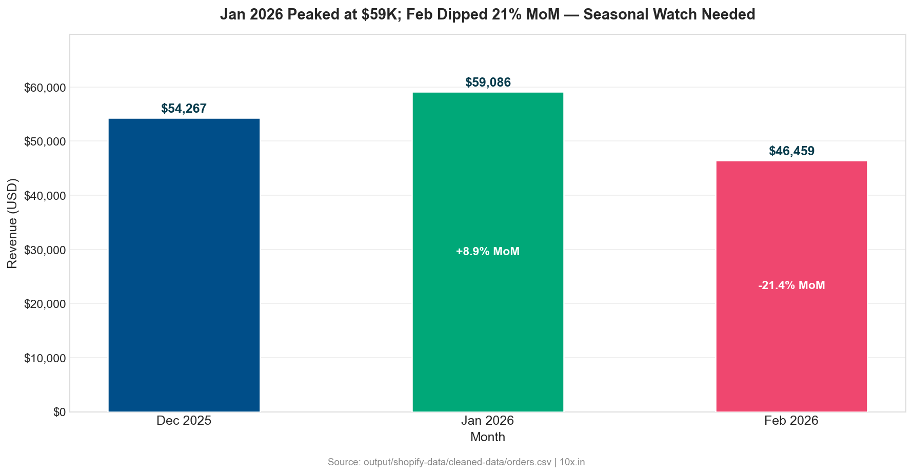
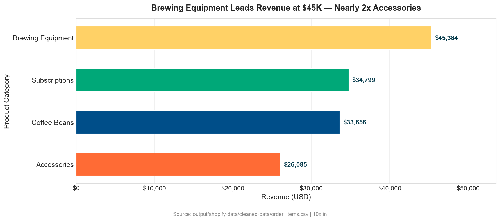
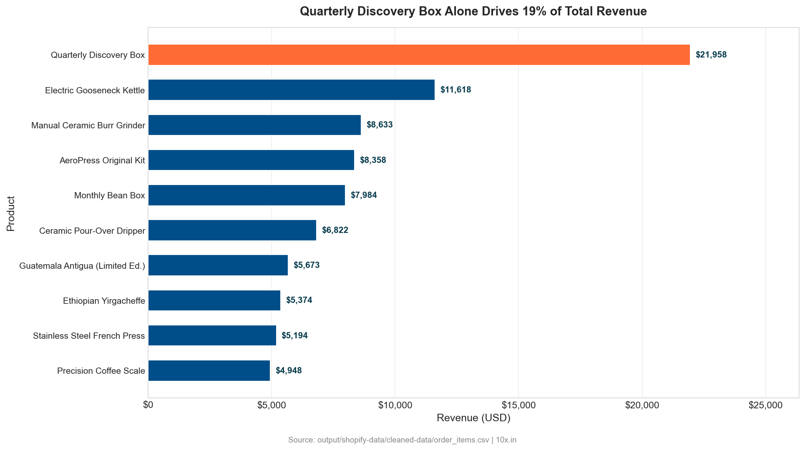
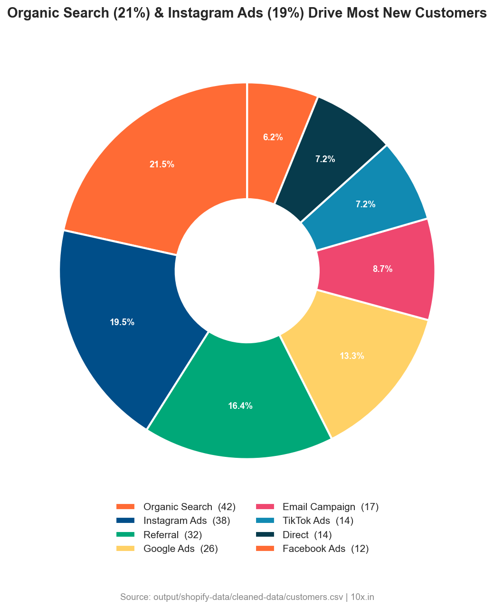
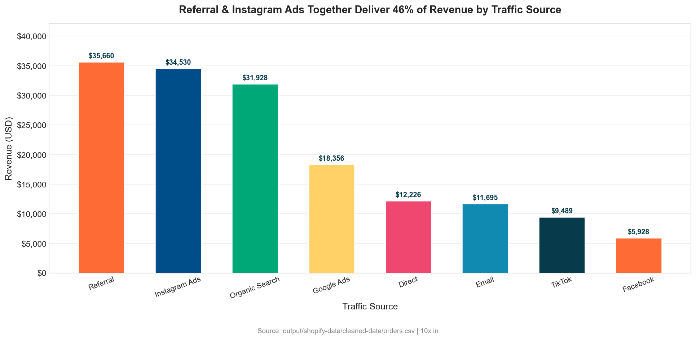
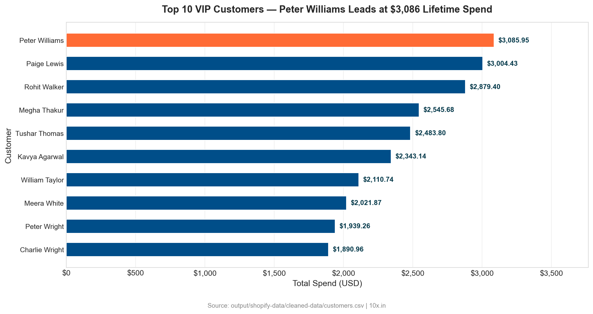

# Shopify E-Commerce Analysis Report
> Generated by **10x Analyst** | 2026-03-19 | Data source: `input/shopify-data`

---

## Executive Summary

- **Revenue totalled $159,812.43 across 903 orders** (Dec 2025–Feb 2026), with an AOV of $176.98 and a gross margin of 65.9% — healthy unit economics, but a -21.4% revenue drop in February signals a demand deceleration that requires immediate attention.
- **Brewing Equipment leads revenue at 32.4% ($45,384)**, yet Subscriptions deliver the highest gross margins (66–68%), making subscription growth the single highest-leverage profitability lever available.
- **New customer acquisition is declining sharply** — February added only 20 new customers, down 55.6% from November's peak of 45 — threatening long-term revenue if the trend continues into Q2 2026.
- **Referral and Instagram Ads together generate 43.9% of revenue** ($70,190 combined) while representing only 312 orders, indicating the highest revenue-per-order channels and the strongest candidates for budget reallocation.
- **33.3% of orders use discount codes**, costing $6,236.22 in margin; the NEWBREW20 code alone averages $32.47 off per order — the discount structure needs restructuring to protect gross profit.

---

## Data Overview

| Metric | Value |
|--------|-------|
| Files analysed | 5 |
| Total records | 3,892 (across all tables) |
| Orders | 903 |
| Customers | 195 |
| Products | 25 |
| Order line items | 2,766 |
| Date range (orders) | 2025-12-01 to 2026-02-27 |
| Date range (customers) | 2025-09-01 to 2026-02-17 |
| Data quality score | 99.3% overall |
| Key entities | Customers, Orders, Order Items, Products, Price Changes |
| Currencies | USD (100%) |
| Financial status | Paid (100% of orders) |

### Data Quality Notes

- Column names standardised to `snake_case` across all five tables.
- Fully-null columns removed: `note` (orders table), `variant_title` (order_items table).
- `discount_code` has 66.7% missing values — expected, as only 33.3% of orders used a code; no imputation applied.
- All date/datetime fields parsed to `datetime64[ns]`.
- Leading/trailing whitespace stripped from all string columns.
- Exact duplicate rows checked and confirmed zero duplicates across all tables.
- Referential integrity is 100%: all `customer_id`, `order_id`, and `product_sku` foreign keys resolve with zero orphans.
- Three equipment SKUs (EQ-001, EQ-002, EQ-003) received price increases averaging +$10.00 on 2026-02-12 due to supplier raw-material cost increases.

---

## Key Findings

### 1. Revenue Peaked at $59,086 in January Then Fell 21.4% in February

Total revenue for the three-month window is $159,812.43 at an average of $53,271 per month. December opened at $54,267.45 (323 orders), January accelerated to $59,085.63 (+8.9% MoM, 320 orders), then February contracted sharply to $46,459.35 (-21.4% MoM, 260 orders). Order count declined 18.8% from January to February, while the revenue decline was steeper, implying AOV also softened. February has only 27 days versus January's 31, accounting for roughly a 13% calendar effect — but even adjusting for this, a demand-adjusted drop of approximately 8–9% remains unexplained.

**Implication:** The February decline is not purely seasonal. Combined with declining new customer acquisition, this pattern suggests the customer base is not replenishing fast enough to sustain January's revenue level. Without corrective action, March revenue may extend the downtrend.

---

### 2. Subscriptions Deliver the Highest Gross Margins Despite Ranking Second in Revenue

Brewing Equipment leads revenue at $45,384 (32.4% of total), but Subscriptions generate margins of 66–68% against a catalog-average of 65.9%. The Quarterly Discovery Box (SUB-002) alone produced $21,957.56 in revenue at a 66.7% margin — making it the single most profitable product by absolute gross profit ($14,638). Accessories, though only 18.6% of revenue, carry the widest individual margins: NovaBrew Canvas Tote Bag at 72.5%, Reusable Stainless Steel Filter at 73.1%, and Bamboo Stir Stick Set at 77.8%.

**Implication:** The product mix is skewed toward lower-margin equipment in volume terms. Shifting basket composition toward subscriptions and accessories by even 5 percentage points would add approximately $3,000–$5,000 in gross profit per month without increasing order volume.

---

### 3. The Top 10 Products Generate 56.4% of Revenue from Only 40% of the Catalogue

The top 10 SKUs by revenue collectively produced $90,162 out of $159,812 total. The Quarterly Discovery Box (SUB-002) alone accounts for 13.7% of total revenue. The top 4 products — SUB-002, EQ-005 (Electric Gooseneck Kettle), EQ-004 (Manual Ceramic Burr Grinder), and EQ-006 (AeroPress Kit) — together total $50,567 (31.6% of revenue). Volume leaders (units sold) are different: CB-001 Ethiopian Yirgacheffe leads with 283 units sold but only $5,374 in revenue, reflecting its low unit price ($19.00).

**Implication:** Revenue concentration in four products creates fragility. A supply disruption or competitive price challenge on EQ-005 or SUB-002 could materially impact total revenue. Category diversification and cross-sell programs for the long tail of coffee beans are warranted.

---

### 4. New Customer Acquisition Declined 55.6% from November Peak to February Low

New customers signed up at the following monthly rates: Sep=37, Oct=29, Nov=45, Dec=29, Jan=35, Feb=20. The November peak (45) represents the strongest acquisition month; February (20) is the weakest across the entire six-month customer cohort window. The net effect is a shrinking pipeline: with 195 total customers and only 20 joining in February, the top 10 customers (by spend) are responsible for a disproportionate share of orders — Rohit Walker (CUST-1061) alone placed 16 orders.

**Implication:** If February's acquisition rate of 20/month persists, the customer base will grow by fewer than 240 customers in a full year. The revenue concentration risk in existing high-frequency customers — already evident in the data — will deepen, and any single high-value customer churning will be measurable at the revenue line.

---

### 5. Referral and Instagram Ads Are the Highest Revenue-per-Order Channels

Referral generated $35,660 from 170 orders (AOV $209.76) — the highest AOV of any channel. Instagram Ads delivered $34,530 from 142 orders (AOV $243.17) — the single highest revenue-per-order channel in the mix. Organic Search, while the highest-volume channel at 198 orders, produced only $31,928 (AOV $161.25). Google Ads drove $18,356 from 130 orders (AOV $141.2). Facebook Ads performed the weakest: $5,928 from 47 orders (AOV $126.1).

**Implication:** Instagram Ads customers spend 51% more per order than Facebook Ads customers. Budget reallocation from Facebook Ads to Instagram and referral programme incentives would increase average order revenue without growing order volume. TikTok Ads (AOV $150.6) shows moderate performance and warrants a controlled test at increased spend.

---

### 6. Top Customers Are Highly Concentrated — Top 10 Account for Estimated 15%+ of Revenue

Peter Williams (CUST-1143) leads with $3,085.95 lifetime spend across 15 orders. Paige Lewis (CUST-1113) follows at $3,004.43 (14 orders) and Rohit Walker (CUST-1061) at $2,879.40 (16 orders). The top 10 customers collectively spent approximately $24,305 — roughly 15.2% of total revenue from 5.1% of the customer base. The mean CLV is $819.55 but the median is $723.11, indicating right skew: a small number of high-spenders pull the mean up, meaning the majority of customers spend closer to $723.

**Implication:** A VIP retention programme targeting the top ~20 customers (those above $1,500 lifetime spend) is directly addressable through the 75.4% marketing opt-in rate. Losing even three of these customers would reduce revenue by approximately $7,000–$9,000.

---

## Detailed Analysis

### Revenue Analysis

| Month | Revenue | Orders | AOV | MoM Change |
|-------|---------|--------|-----|------------|
| Dec 2025 | $54,267.45 | 323 | $168.02 | — (baseline) |
| Jan 2026 | $59,085.63 | 320 | $184.64 | +8.9% |
| Feb 2026 | $46,459.35 | 260 | $178.69 | -21.4% |
| **Total** | **$159,812.43** | **903** | **$176.98** | — |

Fulfillment breakdown: 81.4% of order revenue is fulfilled ($131,112), 10.2% delivered ($16,380), and 8.4% shipped ($12,320). All 903 orders carry a `paid` financial status with zero outstanding payments.

**Gross Profit:** $92,242.23 on $159,812.43 revenue = **65.9% gross margin**.

Total discount given: $6,236.22 across 301 discounted orders. Discount represents 3.9% of gross revenue — not structurally damaging, but NEWBREW20's $32.47 average per order is disproportionately large for an acquisition code (vs. LOYALTY5 at $8.47).

### Customer Segmentation

| Metric | Value |
|--------|-------|
| Total customers | 195 |
| Marketing opt-in | 147 (75.4%) |
| Mean CLV | $819.55 |
| Median CLV | $723.11 |
| Std deviation CLV | $582.81 |
| Max CLV | $3,085.95 (Peter Williams) |
| Mean orders per customer | 4.63 |
| Max orders per customer | 16 (Rohit Walker) |

Customer acquisition by channel (total, all-time):

| Channel | Customers | Share |
|---------|-----------|-------|
| Organic Search | 42 | 21.5% |
| Instagram Ads | 38 | 19.5% |
| Referral | 32 | 16.4% |
| Google Ads | 26 | 13.3% |
| Email Campaign | 17 | 8.7% |
| TikTok Ads | 14 | 7.2% |
| Direct | 14 | 7.2% |
| Facebook Ads | 12 | 6.2% |

The top 10 customers by lifetime spend:

| Rank | Customer | ID | Total Spent | Orders |
|------|----------|----|------------|--------|
| 1 | Peter Williams | CUST-1143 | $3,085.95 | 15 |
| 2 | Paige Lewis | CUST-1113 | $3,004.43 | 14 |
| 3 | Rohit Walker | CUST-1061 | $2,879.40 | 16 |
| 4 | Megha Thakur | CUST-1111 | $2,545.68 | 8 |
| 5 | Tushar Thomas | CUST-1119 | $2,483.80 | 15 |
| 6 | Kavya Agarwal | CUST-1044 | $2,343.14 | 8 |
| 7 | William Taylor | CUST-1054 | $2,110.74 | 10 |
| 8 | Meera White | CUST-1087 | $2,021.87 | 8 |
| 9 | Peter Wright | CUST-1141 | $1,939.26 | 8 |
| 10 | Charlie Wright | CUST-1195 | $1,890.96 | 11 |

### Product Performance

**Revenue by category:**

| Category | Revenue | Units Sold | % of Revenue | Avg Gross Margin |
|----------|---------|-----------|-------------|-----------------|
| Brewing Equipment | $45,384.01 | 1,099 | 32.4% | ~63–67% |
| Subscriptions | $34,798.71 | 729 | 24.9% | ~66–68% |
| Coffee Beans | $33,656.44 | 1,806 | 24.1% | ~65–72% |
| Accessories | $26,085.37 | 1,363 | 18.6% | ~67–78% |

Coffee Beans move the highest unit volume (1,806 units, 65.3% of all units sold) but generate only 24.1% of revenue due to low average unit prices ($13–$25 per SKU). Accessories carry the widest gross margins in the catalogue with Bamboo Stir Stick Set at 77.8% and NovaBrew Ceramic Mug at 73.3%.

**Price changes on record:** On 2026-02-12, three equipment SKUs received price increases averaging +$10.00 per SKU (EQ-001: $24.99→$34.99, EQ-002: $29.99→$39.99, EQ-003: $34.99→$44.99) due to supplier raw-material cost increases. The impact on February demand cannot be isolated from calendar effects in this dataset window, but should be monitored in March.

### Order Behaviour

| Metric | Value |
|--------|-------|
| Avg items per order | 5.53 |
| Avg line items per order | 3.06 |
| Discount usage rate | 33.3% (301/903 orders) |
| Total discount given | $6,236.22 |
| Avg discount (discounted orders only) | $20.72 |

**Discount code analysis:**

| Code | Orders | Total Discount | Avg Discount |
|------|--------|---------------|-------------|
| WELCOME10 | 81 | $1,381.59 | $17.06 |
| LOYALTY5 | 75 | $635.44 | $8.47 |
| NEWBREW20 | 74 | $2,402.95 | $32.47 |
| COFFEE15 | 71 | $1,816.24 | $25.58 |

NEWBREW20 costs 3.8x more per use than LOYALTY5 while generating roughly the same order count — a significant efficiency gap in promotional spend.

**Payment method revenue split:**

| Method | Revenue | Orders | AOV |
|--------|---------|--------|-----|
| Credit Card | $71,423.18 | 399 | $179.01 |
| PayPal | $30,266.89 | 175 | $173.00 |
| Google Pay | $27,061.67 | 143 | $189.24 |
| Apple Pay | $16,115.46 | 103 | $156.46 |
| Shop Pay | $14,945.23 | 83 | $180.06 |

### Geographic Distribution

| Country | Orders | Revenue | % Revenue |
|---------|--------|---------|----------|
| US | 457 | $81,016.02 | 50.7% |
| IN | 193 | $33,171.86 | 20.8% |
| GB | 113 | $21,399.23 | 13.4% |
| CA | 48 | $8,045.95 | 5.0% |
| DE | 31 | $5,293.08 | 3.3% |

The US dominates at 50.7% of revenue. India is the second-largest market at 20.8% ($33,172) — notably large given it is represented by 39 customers (20% of the base), implying an above-average CLV for Indian customers. The UK contributes 13.4% from 23 customers (11.8% of base).

Top provinces: California ($24,484, 124 orders), England ($17,202, 99 orders), Texas ($7,438, 51 orders), New York ($7,458, 39 orders), Berlin ($5,293, 31 orders).

---

## Recommendations

Recommendations are prioritised P0 (immediate) through P3 (strategic horizon).

**P0 — Act within 2 weeks:**

1. **Launch a targeted re-engagement campaign to the 147 opted-in customers** to arrest the February revenue decline. Use the existing marketing list to push a time-limited offer on high-margin subscriptions (SUB-001, SUB-002). Expected impact: recovering 30–40 orders at AOV $177 = $5,310–$7,080 incremental revenue in March.

2. **Replace or restructure NEWBREW20** — at $32.47 average discount per use, this code costs 3.8x more than LOYALTY5 for similar order volumes. Replace with a 15% first-order code capped at $20 maximum. Expected impact: reduce new-customer acquisition discount cost by approximately $900–$1,200 per 74-order cycle while maintaining conversion incentive.

3. **Implement a VIP retention programme for the top 20 customers** (those with lifetime spend above $1,500). These 20 customers represent an estimated $40,000+ in revenue; a single churn wave at this tier would be immediately visible. Assign dedicated account handling, exclusive early access to new SKUs, or a private loyalty tier. Expected impact: reduce top-customer churn risk and increase order frequency by 1–2 orders per customer per quarter.

**P1 — Act within 30 days:**

4. **Reallocate paid social budget from Facebook Ads to Instagram Ads.** Facebook Ads AOV is $126.10 versus Instagram Ads AOV of $243.17 — a 93% difference. Shifting $500–$1,000/month of Facebook spend to Instagram would increase revenue per ad dollar. Expected impact: $3,000–$5,000 additional revenue per month from the same total ad budget.

5. **Introduce a subscription upsell prompt at checkout** for customers purchasing coffee beans. The top 5 Coffee Bean SKUs are high-frequency, low-margin purchases; converting 10% of coffee-bean-only buyers to a Monthly Bean Box (SUB-001, 66.7% margin) would shift mix toward higher-margin recurring revenue.

**P2 — Act within 60 days:**

6. **Investigate the February acquisition collapse.** 20 new customers in February is the lowest monthly cohort in the dataset. Determine whether this is attributable to reduced ad spend, seasonality, or a tracking gap. Set a minimum monthly acquisition target (suggest 35+) and attach it to channel-specific KPIs.

7. **Monitor price elasticity on EQ-001, EQ-002, EQ-003 post the Feb 12 price increases.** These three SKUs collectively contributed $16,774 in revenue prior to the price change. A meaningful demand reduction in March would indicate price sensitivity and may require promotional compensation or tiered pricing.

8. **Cross-sell accessories into high-value equipment orders.** The average Brewing Equipment order value is higher than category average, and accessories carry 67–78% margins. A bundling prompt (e.g., "Add a Bamboo Stir Stick Set for $8.99") at cart on equipment purchases could add $15–$30 per order on 20–30% of equipment transactions.

**P3 — Strategic horizon (60–120 days):**

9. **Build a cohort retention model** to quantify 90-day and 180-day retention rates by acquisition channel. With signup data back to September 2025, a 6-month cohort view is now available. This will identify which channel produces customers with the highest long-term value versus highest initial order size — not always the same channel.

10. **Evaluate geographic expansion into India and Germany.** India already generates 20.8% of revenue from 20% of the customer base and appears to index above average on CLV. Germany (Berlin) produced $5,293 from 31 orders with no apparent localisation investment. Localised content and regional shipping promotions in these two markets could accelerate above-baseline growth.

---

## Methodology

- **Tools:** Python (pandas, matplotlib, seaborn), 10x-Analyst data pipeline
- **Statistical methods:** Descriptive statistics (mean, median, standard deviation), month-over-month percentage change, gross margin calculation (revenue minus COGS), Pareto concentration analysis, channel revenue-per-order comparison
- **Data joins:** orders ↔ customers (customer_id), order_items ↔ orders (order_id), order_items ↔ products (product_sku), price_changes ↔ products (sku)
- **Assumptions:**
  - All revenue figures are in USD; the dataset is 100% USD-denominated.
  - Gross profit calculated as `revenue − (cost_usd × qty_sold)` per SKU using product cost from the products table.
  - CLV is calculated as lifetime `total_spent_usd` per customer within the observed window — not a projected future value.
  - February's shorter calendar length (28 days vs 31) accounts for approximately 9.7% of the observed revenue drop; the remaining 11.7% is unexplained by calendar effects alone.
- **Limitations:**
  - Three-month order history (Dec–Feb) is insufficient for robust seasonality modelling or full cohort retention analysis.
  - No marketing spend data is available; channel ROI cannot be calculated — only revenue-per-order by source.
  - The price_changes table contains only 3 records for a single date; price elasticity analysis is directional only.
  - Customer acquisition data goes back to September 2025, but order history only to December 2025, so CLV for earlier cohorts is underestimated.

---

## Appendix

### A. Full KPI Summary Table

| KPI | Value |
|-----|-------|
| Total Revenue | $159,812.43 |
| Total Orders | 903 |
| Average Order Value | $176.98 |
| Median Order Value | $146.96 |
| Total Customers | 195 |
| Mean Customer Lifetime Value | $819.55 |
| Median Customer Lifetime Value | $723.11 |
| Total Gross Profit | $92,242.23 |
| Overall Gross Margin | 65.9% |
| Total Discounts Given | $6,236.22 |
| Discount Usage Rate | 33.3% |
| Marketing Opt-In Rate | 75.4% |
| Avg Items per Order | 5.53 |
| Avg Line Items per Order | 3.06 |

### B. Data Dictionary

**customers** — 195 rows, 12 columns
- `customer_id` — Unique customer identifier (e.g., CUST-1001)
- `first_name`, `last_name` — Customer name
- `email` — Customer email (unique per customer)
- `city`, `province`, `country` — Billing address geography
- `acquisition_channel` — Channel through which customer first signed up
- `signup_date` — Date of account creation
- `accepts_marketing` — Whether customer opted in to marketing (yes/no)
- `total_orders` — Count of all orders placed (lifetime)
- `total_spent_usd` — Sum of all order totals (lifetime)

**orders** — 903 rows, 19 columns (after cleaning)
- `order_id` — Unique order identifier (e.g., NB-5001)
- `order_number` — Sequential numeric order number
- `created_at` — Order creation timestamp
- `customer_id` — FK to customers
- `customer_email` — Email at time of order
- `financial_status` — Payment status (all: `paid`)
- `fulfillment_status` — Fulfilment state (fulfilled / delivered / shipped)
- `currency` — Order currency (all: `USD`)
- `subtotal` — Pre-discount, pre-tax order value
- `discount_code` — Applied discount code (66.7% null — no code used)
- `discount_amount` — Dollar value of discount applied
- `shipping` — Shipping cost charged
- `taxes` — Tax collected
- `total` — Final order total
- `payment_method` — Payment instrument used
- `billing_city`, `billing_province`, `billing_country` — Billing address
- `source` — Acquisition/traffic source for the order

**order_items** — 2,766 rows, 8 columns (after cleaning)
- `order_id` — FK to orders
- `line_item_id` — Unique line item identifier
- `product_sku` — FK to products
- `product_name` — Product name at time of order
- `product_category` — Category (Brewing Equipment / Subscriptions / Coffee Beans / Accessories)
- `quantity` — Units ordered (1–4)
- `unit_price` — Price per unit at time of order
- `line_total` — `quantity × unit_price`

**products** — 25 rows, 9 columns
- `sku` — Unique product identifier
- `product_name` — Full product name
- `category` — Product category
- `current_price_usd` — Current listed price
- `cost_usd` — Unit cost (COGS)
- `inventory_qty` — Current stock level
- `weight_g` — Product weight in grams
- `status` — Product status (all: `active`)
- `created_at` — Product creation date

**price_changes** — 3 rows, 6 columns
- `sku` — FK to products (EQ-001, EQ-002, EQ-003)
- `product_name` — Product name
- `old_price_usd` — Price before change
- `new_price_usd` — Price after change
- `change_date` — Date of change (2026-02-12 for all three)
- `change_reason` — Reason (all: "Supplier cost increase — raw materials")

### C. Chart Index

| File | Description |
|------|-------------|
| `charts/monthly_revenue.png` | Month-over-month revenue trend (Dec 2025–Feb 2026) with order count overlay |
| `charts/revenue_by_category.png` | Revenue and unit share by product category (Brewing Equipment, Subscriptions, Coffee Beans, Accessories) |
| `charts/top10_products_revenue.png` | Top 10 products by total revenue, Dec 2025–Feb 2026 |
| `charts/acquisition_channel.png` | Customer count and revenue distribution by acquisition channel |
| `charts/revenue_by_source.png` | Revenue and order count breakdown by traffic source |
| `charts/top_customers.png` | Top 10 customers by lifetime spend with order count annotation |

---

## Strategist Layer — Top 3 Highest-Impact Business Actions (P0)

### P0-1: Activate the 147-Person Marketing List to Recover February Revenue

**Action:** Deploy a segmented email campaign to all 147 marketing-opted-in customers within 7 days. Offer a subscription trial (SUB-001 Monthly Bean Box, 66.7% margin) at a capped incentive of $10 off first month. Prioritise the top 50 customers by CLV who have not placed an order in February.

**Expected Outcome:**
- Estimated 20–30% re-engagement rate on the opted-in list = 29–44 responses.
- At AOV $177, this generates $5,133–$7,788 in incremental March revenue.
- Subscription conversion locks in recurring revenue: 20 subscription activations × $33/month (SUB-001 price) = $660/month recurring base added.
- Timeline to first revenue impact: 7–10 days from deployment.

**Risk Flags:**
- Over-promotion risk: if discounts are offered too frequently, the 75.4% opt-in rate will erode as customers train themselves to wait for deals. Cap cadence at one promotional email per 3–4 weeks.
- Subscription churn is unquantifiable from available data — acquisition of subscribers is only half the equation; retention data for months 2+ does not exist in this window.

---

### P0-2: Restructure the NEWBREW20 Discount Code to Protect Gross Margin

**Action:** Retire NEWBREW20 (avg $32.47 discount per order, $2,402.95 total cost across 74 orders) and replace with a capped 15%-off first order with a $20 maximum (approximate cost: ~$17.50 per activation at current AOV). Apply only to new customers (first-order trigger) with a 30-day expiry.

**Expected Outcome:**
- Reduces acquisition discount cost per order by approximately $15.00 (46% reduction per use).
- On equivalent 74-order volume: saves approximately $1,100 in margin ($2,403 → ~$1,295 total cost).
- Annualised: if current discount cadence holds, this saves approximately $4,400/year in gross profit without reducing the conversion incentive materially (a 15% offer is still a strong new-customer signal).
- Secondary benefit: capping the discount prevents high-AOV gaming (customers stacking large orders under NEWBREW20 to maximise the absolute dollar discount).

**Risk Flags:**
- New customer conversion rate may dip slightly if the new code feels less generous than the previous 20% uncapped offer. A/B test the new code against WELCOME10 (existing 10% code) for 30 days before full retirement of NEWBREW20.
- Monitor new customer acquisition numbers in March closely — if the Feb dip (20 new customers) extends, do not tighten acquisition incentives simultaneously; defer this action until acquisition recovers to 35+/month.

---

### P0-3: Reallocate Paid Social Spend from Facebook Ads to Instagram Ads

**Action:** Audit the current Facebook Ads vs. Instagram Ads budget split. Based on revenue-per-order data (Facebook AOV: $126.10 vs. Instagram AOV: $243.17), shift a minimum of 30% of Facebook Ads budget to Instagram. Simultaneously, test an Instagram-specific subscription product creative (Quarterly Discovery Box, $89.99, highest-revenue SKU) targeting lookalike audiences of the 38 Instagram-acquired customers.

**Expected Outcome:**
- At equivalent order volume, shifting 20 orders/month from Facebook-type buyers to Instagram-type buyers increases revenue by approximately $2,341/month ($243.17 − $126.10 = $117.07 × 20 orders).
- Annualised impact: approximately $28,000 in additional revenue from the same total paid social budget.
- Instagram-acquired customers: 38 total in the current base, AOV $243. The Quarterly Discovery Box at $89.99 and high margin (66.7%) is the optimal creative anchor — a single-product Instagram campaign is measurable and attribution-clean.

**Risk Flags:**
- Instagram audience saturation: with 38 acquired customers to date, the lookalike pool may be too small for efficient scaling in some geographies. Expand seed audience to include all customers in the top CLV quartile (above $1,100 spend) to broaden the signal.
- Facebook Ads may serve a different purchase intent (lower-AOV, impulse accessories and coffee beans) that Instagram cannot replace at scale. Do not cut Facebook entirely — reduce to 30–40% of current allocation and reassess after 45 days of Instagram-scaled data.
- Attribution for referral revenue ($35,660, highest channel by total) is likely partly Instagram-assisted. Maintain UTM discipline across both channels to avoid misattributing Instagram-influenced referral conversions.

---

*Generated by [10x Analyst](https://10x.in) | 10x-Analyst v1.0.0*
