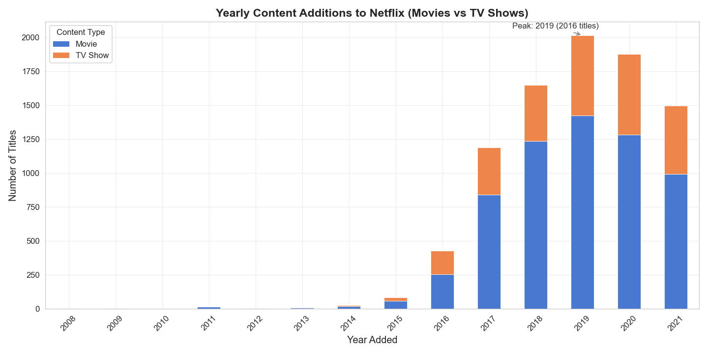
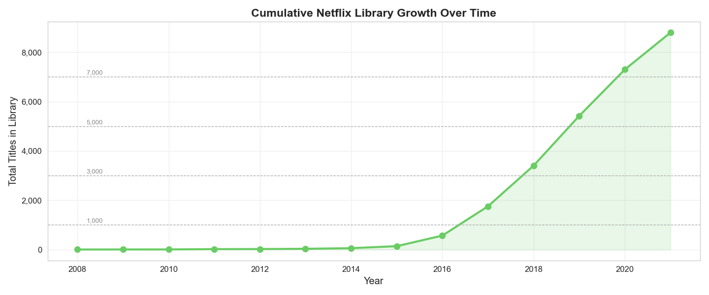
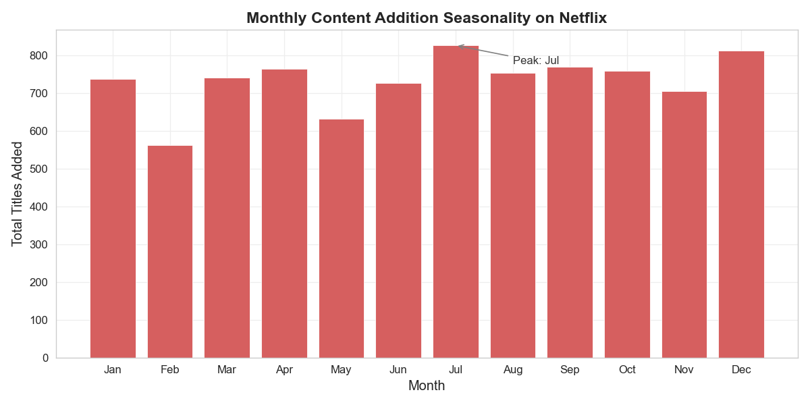
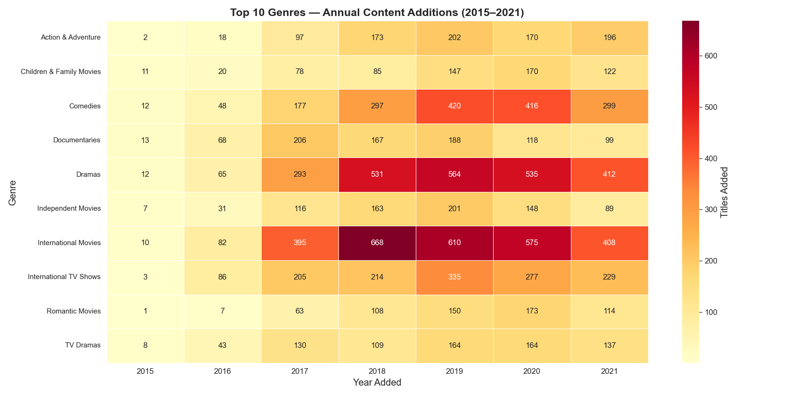
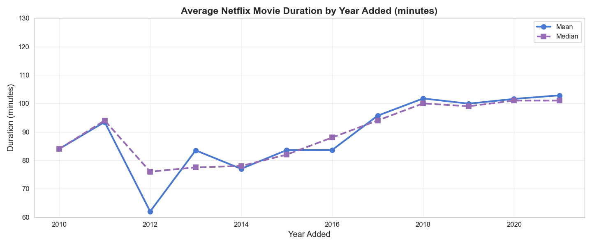
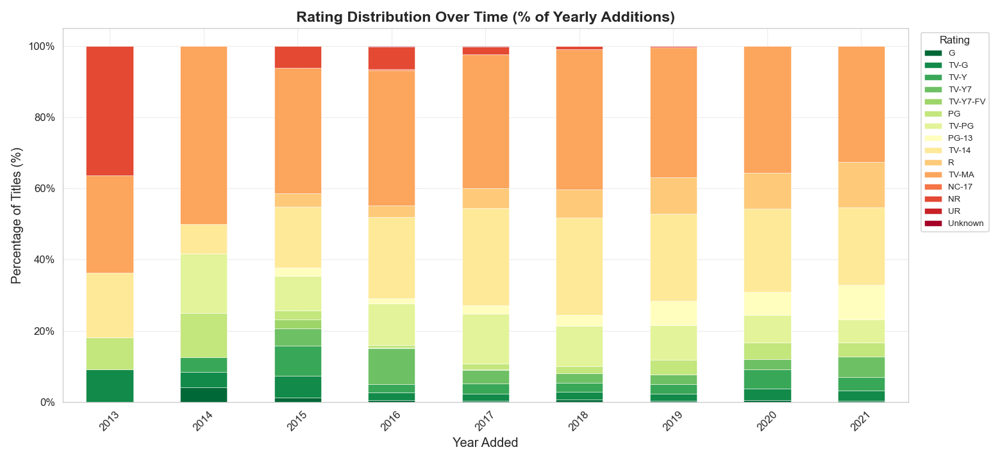

# Netflix Content Trend Analysis

**Dataset:** `netflix-data`
**Date Generated:** 2026-03-20
**Titles Analysed:** 8,797 (with date_added metadata)

---

## Chart 1 — Yearly Content Additions (Movies vs TV Shows)

**Insight:**
Netflix content additions grew dramatically from 2008 to 2019, peaking at 2016 titles added in 2019. Movies consistently outnumber TV shows in yearly additions, though TV show share has grown steadily since 2015. The fastest single-year growth occurred around 2017, reflecting Netflix's aggressive content investment phase.

---

## Chart 2 — Cumulative Library Growth

**Insight:**
Netflix's cumulative library grew to approximately 8,797 titles by 2021, with the steepest growth curve emerging after 2015 when the platform went global. The S-curve trajectory suggests the library was doubling roughly every 2-3 years during peak expansion. Post-2019 growth reflects both organic additions and the impact of COVID-driven content demand.

---

## Chart 3 — Monthly Release Seasonality

**Insight:**
Netflix shows a clear seasonality in content additions, with Jul being the single biggest month. The top 3 release months are Jul, Dec, Sep, likely aligned with subscriber acquisition campaigns and Q4 holiday viewing spikes. January often shows a secondary peak as Netflix refreshes the library for New Year audiences.

---

## Chart 4 — Top 10 Genres Over Time

**Insight:**
'International Movies' is consistently the most represented genre on Netflix, reflecting the platform's global-first content strategy. International content categories have seen the sharpest absolute growth since 2018, signalling Netflix's deliberate push into non-English-language originals. Traditional genres like Dramas and Comedies remain evergreen anchors of the library.

---

## Chart 5 — Average Movie Duration by Year

**Insight:**
The average Netflix movie duration has trended longer over the analysis period, moving from ~84 minutes (in 2010) to ~103 minutes (in 2021). The gap between mean and median remains narrow, suggesting few extreme outliers skew the data. This likely reflects Netflix balancing traditional theatrical runtimes with shorter, mobile-friendly content.

---

## Chart 6 — Rating Distribution Over Time

**Insight:**
TV-MA (mature) content has increased as a share of yearly additions, moving from ~27.3% to ~32.6% of annual titles. TV-14 and PG-13 together consistently form the largest rating block, suggesting Netflix targets a broad teen-and-above demographic. Family-friendly ratings (TV-G, TV-Y, PG) remain a stable but minority segment of the catalog.

---

## Key Findings Summary

| # | Finding |
|---|---------|
| 1 | Content additions peaked around **2019**, with Movies dominating volume |
| 2 | The library grew to **8,797** tracked titles, with exponential growth post-2015 |
| 3 | **Jul** is the highest-volume release month — likely driven by subscriber growth campaigns |
| 4 | **International genres** are the fastest-growing content category |
| 5 | Movie durations have trended **longer** over time, reflecting shifting viewer habits |
| 6 | Mature content (TV-MA) share has **increased** — Netflix leans into adult-skewing originals |

---

## Handoff Notes for Downstream Agents

- **Content Strategist:** Focus competitive analysis on International, Drama, and Documentary categories given their growth trajectory.
- **Geo Analyst:** Cross-reference International genre growth with country-level production data.
- **Dashboard Builder:** Prioritise Chart 1 (yearly additions) and Chart 4 (genre heatmap) as hero visuals.
